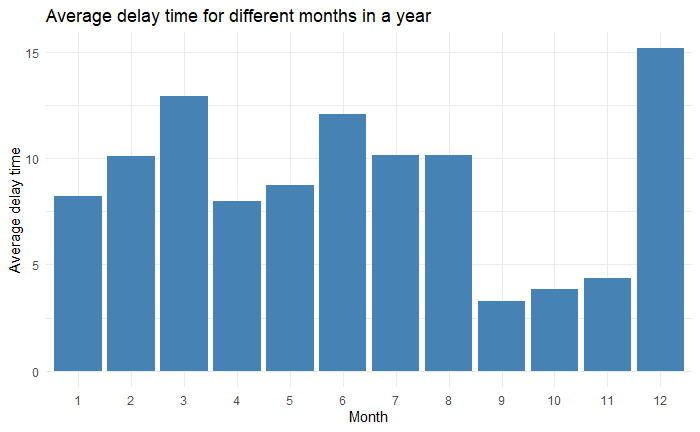
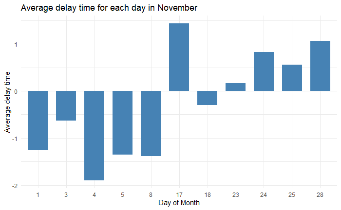

Introduction
------------

The data set in ABIA.csv, contains information about all flights’ that
either departed from or landed at Austin-Bergstrom Interational in 2008
and after conducting careful analysis, we make a prediction on the best
time to travel in order to suffer less from the flight delay.

Assumption
----------

Before starting to set up a model, we assume that the total delay time
of a flight is represented by the departure delay time. We made this
assumption since a flight with a departure delay will be likely to have
an arrival delay and our assumption can avoid an over-estimation of
delay time on each flight. Although the flight with departure delay is
still possible to arrive on time, this is caused by unique climate
phenomenon like the change of wind speed and direction, which is not
possible to predict at this moment.

Best time of the day
--------------------

First of all, we try to decide when is the best time to fly in a day. So
we compute the average flight delay of each time. Our graph of departure
time versus average delay time is presented below.

After checking from the Austin-Bergstrom Interational offical website,
the last flight that departs in a day is at 23:59. This tells us that
all the flights after 24:00 will be delayed. From our plot, it is
obvious that the flights departing from 5:00 to 15:00 have shorter delay
time. Hence, we only keep the flights that depart between 5:00 and 15:00
to adjust the plot. As we can see in the graph below, choosing the
flights that depart after 5:00 and also before 8:00 is the best option
to minimize the delay. (The warning we have here is because we remove
the flights before 5:00 and after 15:00.)

    ## Warning: Removed 628 rows containing missing values (geom_point).

Best day of the year
--------------------

Secondly, we compute the monthly average flight delay time in 2008. From
the diagram, it is clear that in average, the flights departing in
September, October, and November suffered the least from delay in 2008.
Then we decide to analyze each month seprately to figure out whether
there exists a cetain partern in these three months.

### Best day of the year - September

Focusing on the subdataset of September, after computing the average
delay time for each day of September, we remove the days with average
delay time larger than 1.5 miniutes. Graph 1 below is a plot of the days
with average delay time smaller than 1.5 minutes versus their actual
average delay time. For those days, we pair each of them to their actual
day of the week. The table under graph 1 is the count number of day of
week we have in the existing data set. To be more specific, we draw
another graph to show the average delay time in these four weekdays we
have. In conclusion, Tuesday and Saturday have the highest probability
of having a delay time less than 0.2 mins in September. They are
possibly the good days to fly in September.

    ## # A tibble: 4 x 3
    ##   DayOfWeek Countnum avedelay
    ##   <fct>        <int>    <dbl>
    ## 1 1                2    0.788
    ## 2 2                3   -0.409
    ## 3 3                2    0.532
    ## 4 6                3    0.102

### Best day of the year - October and November

Then, we use the same method to analyze the data from October and
November.

#### October:

As for October, Mondays, Tuesdays, Fridays and Saturdays have the
highest frequnency of being the good days to fly in October. Especially
on Saturday, the flights will be likely to depart 0.75 minute ahead.

    ## # A tibble: 5 x 3
    ##   DayOfWeek Countnum avedelay
    ##   <fct>        <int>    <dbl>
    ## 1 1                2    0.424
    ## 2 3                2    0.339
    ## 3 4                1    0.508
    ## 4 5                2    1.15 
    ## 5 6                2   -0.782

#### Novermber:

As for November, Mondays and Tuesdays have the highest frequnency of
being the good days to fly in November. Saturdays are also good chioces
to fly. From our graph, Mondays on November have pretty small delay time
while on Tuesday and Saturdays, flights are likely to fly ahead of time.
So Tuesdays and Saturdays are good choices of day to fly in November.

    ## # A tibble: 6 x 3
    ##   DayOfWeek Countnum avedelay
    ##   <fct>        <int>    <dbl>
    ## 1 1                3    0.544
    ## 2 2                3   -0.545
    ## 3 3                1   -1.36 
    ## 4 5                1    1.07 
    ## 5 6                2   -1.32 
    ## 6 7                1    0.167

To conclude our results above, flights departs on Saturday among these
three months have high frequency of minimizing the delay time. People
fly on Saturdays in these three months are more likely to suffer less
from the flight delay.

Three month together
--------------------

Last but not the least, we combine the data sets of these three months
and double check our results. The graph below shows us that among these
three months, Monday and Saturday have the largest probability for short
delay time.

In order to make an accurate conclusion, we compare the average delay
time in the days we have selected above. The graph below shows that
among those days Saturdays have the least delay flights and are likely
to depart 0.6 minute ahead on average. We believe that this is because
few people will fly for business or travelling on Saturdays.

Conclusion
----------

To sum up, in order to minimize the time of delay, we suggest that
people book the flight which departs in the morning after 5 a.m and
befor 8 a.m, on Saturdays in September, October or November.
