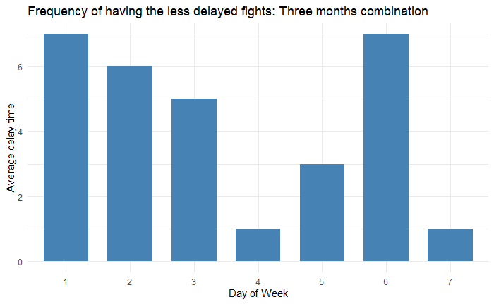

Introduction
------------

We were given data in ABIA.csv, which contains information about all
flights’ that either departed from or landed at Austin-Bergstrom
Interational in 2018 and after conducted careful analysis, we made a
prediction on which time to travel is least possible to suffer delay.

Assumption
----------

In order to find the best time to minimize delay, we assumed that the
departure delay to represent the delay time of an flight. We made this
assumption since a flight with a departure delay will be likely to have
a arrival delay and made this assumption can avoid an over estimation of
delay time on each flight. Although the flight with departure delay is
still possible to arrive on time, this is caused by unique climate
phenomenon like the change of wind speed and direction which is not
possible to predict at this moment.

Best time of the day
--------------------

We tried to find in average what time of the day is likely to suffer
least time of delay. We computed the average flight delay of each time.


After verfied from the Austin-Bergstrom Interational offical website,
the last flight that departure from 11:59 p.m. This tells that all
flight departure after 11 p.m. was delay. From the plot, it is obvious
that flight departured from 5 a.m. to 15 p.m. suffered least delay.

    ## Warning: Removed 628 rows containing missing values (geom_point).


If we focusing on the time frame of this period, we could tell flight
that departure before 8 a.m. is the best option to minimize delay.

Best day of the year
--------------------

First, we computed the monthly average flight delay in 2008.


From the diagram, it is clear that in average, the flight departure in
September, October, and November suffered least time of delay. Then we
analyzed each months seprately to detect if there exists cetain partern.

Best day of the year - September
--------------------------------

Focusing on the data from September, aftered computed the average delay
on each day of September, we filtered out days with average delay that
greater than 1.5 miniutes.


    ## # A tibble: 4 x 3
    ##   DayOfWeek Count.number avedelay
    ##   <fct>            <int>    <dbl>
    ## 1 1                    2    0.788
    ## 2 2                    3   -0.409
    ## 3 3                    2    0.532
    ## 4 6                    3    0.102


Among those days, we paired each of them to their actual day of week.
Given the data, Tuesday and Saturday has the highest frequency and
lowest average delay in September.

Best day of the year - October and November
-------------------------------------------

October
-------


    ## # A tibble: 5 x 3
    ##   DayOfWeek Count.number avedelay
    ##   <fct>            <int>    <dbl>
    ## 1 1                    2    0.424
    ## 2 3                    2    0.339
    ## 3 4                    1    0.508
    ## 4 5                    2    1.15 
    ## 5 6                    2   -0.782


Novermber
---------


    ## # A tibble: 6 x 3
    ##   DayOfWeek Count.number avedelay
    ##   <fct>            <int>    <dbl>
    ## 1 1                    3    0.544
    ## 2 2                    3   -0.545
    ## 3 3                    1   -1.36 
    ## 4 5                    1    1.07 
    ## 5 6                    2   -1.32 
    ## 6 7                    1    0.167


Based on using the same method to analyze the data from October and
November, In average, flights departure on Saturday faced least amount
of delay with a high frequency.

Three month together
--------------------

In the end, we combined the data from these three month and implmented
the same method of analysis.


The first graph tells that among these three month, for all days that
flight in average faced a delay which was less than 1.5 minutes, 6 days
of them are Saturday and 6 times is the highest frequency among these
three month.

``` r
ggplot(data=overalldata , aes(x=DayOfWeek, y=avedelay)) +
  geom_bar(stat="identity", fill="steelblue", width = 0.7)+
  theme_minimal()
```


The second graph shows among those days that flight in average faced
least time of delay, Saturday faced the least among of delay of all days
of week. This is reason since few people travels for both business and
tourism on Saturday.

Conclusion
----------

In order to minimized the time of delay, we suggested that book the
flight that departure in the morning befor 8, on Saturday and in
September, October or November.
