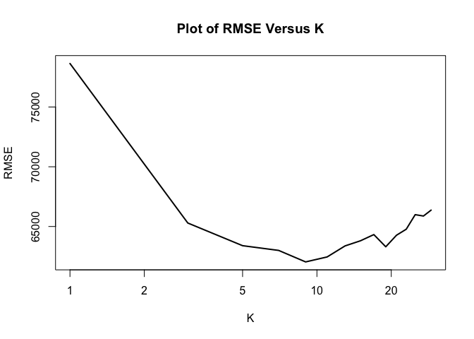

Exercise 2 - Question 1
=======================

### Xiaoyu Liu, Yihao Zhang

The data we used for this question is a data set on house prices in
Saratoga, which includes house prices and 15 other priced related
variables. Our job is to “hand-build” a model for prices that
outperforms the “medium” model, to find the strong drivers of house
prices in the best model and to build a KNN model.

Firstly, in order to find our best “hand-build” model, we tried to add
some interaction variables into the model (the transformations or
polynomials don’t seem to be reasonable in this case). For each model,
we split the dataset into a training dataset(80%) and a test
dataset(20%) randomly. Then we trained our model in the training dataset
and calculated the out-of-sample RMSE for the test dataset. For the
purpose of avoiding random variation, we ran the whole process 100 times
and used the average RMSE to measure the model performance. The
“hand-build” model with minimized RMSE we found is:

\*\**price = *β*0 + *β*1bedrooms +
*β*2newConstruction + *β*3heating +
*β*4livingArea + *β*5age +
*β*6waterfront + *β*7centralAir +
*β*8rooms + *β*9landValue +
*β*10lotSize + *β*11bathrooms +
*β*12rooms*heating + *β*13landValue*lotSize +
*β*14rooms*bathrooms + *β*15heating\*centralAir

The average RMSE of our best “hand-build” model for 100 trials is
57672.75. Comparing to the medium model, we can see that it
significantly decreases 66212.45 - 57672.75 = 8539.7. Based on the
interaction terms that we add to our model, we believe that there can be
some relation between rooms and heating, landValue and lotsize, rooms
and bathrooms, plus heating and centralAir. For example, more rooms
means the house is larger, larger house owners will be more able to pay
for the heating and they will also buy more expensive houses. That is
why the interaction term rooms\*heating makes sense.

Secondly, we want to find the strong drivers of our model. We drop each
variable and if the out-of-sample RMSE of that model increases a lot,
the variable should be a strong driver of the model. As Table 2 shows
below, we can see that variables
landValue/livingArea/waterFront/bathrooms respectively decrease the
average RMSE for 6233.37/3214.48/926.14/913.37. Four of them seem to be
the strong drivers of the model.

<table>
<caption>Table 2: RMSE of models that drops the potential strong driver</caption>
<thead>
<tr class="header">
<th style="text-align: center;">Hand-build model</th>
<th style="text-align: center;">Model without landValue</th>
<th style="text-align: center;">Model without livingArea</th>
<th style="text-align: center;">Model without waterFront</th>
<th style="text-align: center;">Model without bathrooms</th>
</tr>
</thead>
<tbody>
<tr class="odd">
<td style="text-align: center;">57672.75</td>
<td style="text-align: center;">63906.12</td>
<td style="text-align: center;">60887.23</td>
<td style="text-align: center;">58598.89</td>
<td style="text-align: center;">58586.12</td>
</tr>
</tbody>
</table>

Last but not the least, compare the best “hand-build” model with the
best KNN model. First of all, we need to delete the variables that are
not included in our “hand-build” model from the dataset. Split the
dataset into a training dataset and a test dataset randomly as usual.
Besides, we need to scale the independent variables for both training
and testing datasets in the same way. In order to find the best K value,
we use a loop to test the performance of different K values from 1 to
100. The graph below shows the RMSE value versus different K. The KNN
model with the minimized RMSE has K value=11. The average RMSE of this
model is 57621.94, which is more than 3000 larger than our ‘hand-build’
model. Hence, this time our “hand-build” model outperforms the KNN
model. However, it is not always true. Building models by hand is such a
tedious work and it’s easy to ignore some important interaction terms.
KNN modeling is smart enough to find them if they are there.

