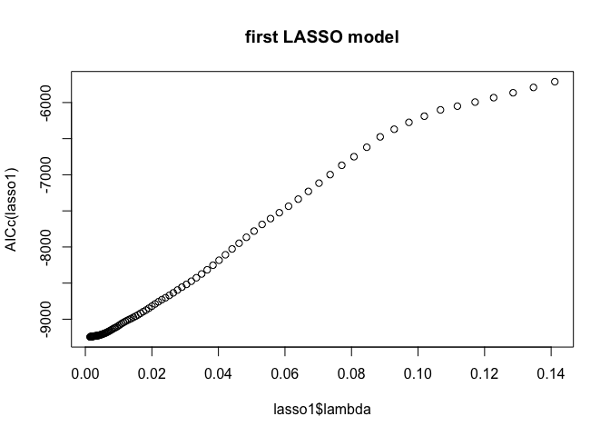
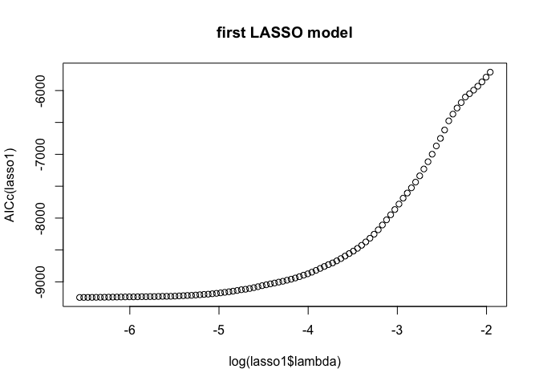
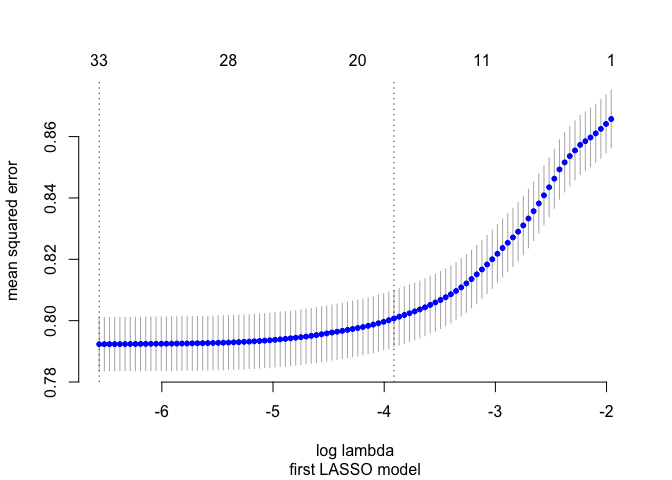
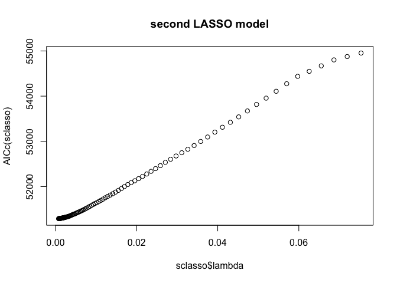
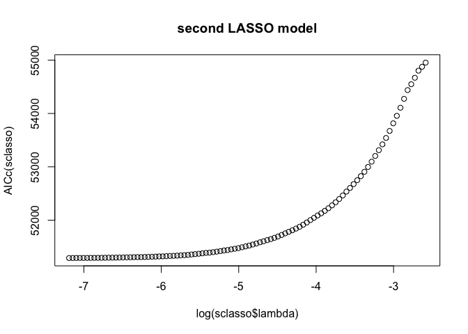

Exercise 2 - Question 3
=======================

### Xiaoyu Liu, Yihao Zhang

The following report is going to discuss how to predict whether an
article published by Mashable is going to be viral based on Information
of 39,797 online articles published by Mashable during 2013 and 2014.
and I used two approaches to make predictions. First approach: build the
model to predict the number of shares first and then add the thresholds.
Second approach: create a variable called viral based on the thresholds
and then build the model to predict the probability for an article to be
viral.

Two thresholds, 1. if shares exceeds 1400, predict the article as
“viral” 2. if shares are 1400 or lower, predict the article as “not
viral”

First approach Since there are more than 30 variables, which is a large
set of potential explanatory variables, we decided to use the LASSO
regression method to predict the number of shares. This method can drive
the coefficients of irrelevant variables to zero, thus performing an
automatic variable selection.

To find the best value of *λ* to built the model, first, we computed the
AICc for each value of *l**o**g*(*λ*) in the above range.

But based on the plot of AICc regarding both *l**o**g*(*λ*) and *λ*,
there doesn’t exist an optimal value for *λ* since the AICc only
decreases when *λ* decreases. So, we used 10-fold cross validation to
find the optimal *λ* for our lasso regression model.

based on cross validation result, we take *l**o**g*(*λ*) =  − 3.911 as
our optimal value for the LASSO model. This is the largest
*l**o**g*(*λ*) value that lies within one standard deviation of the
minimum *l**o**g*(*λ*). *l**o**g*(*λ*) =  − 3.911 will turn the LASSO
model to include the least amounts of variables, and meanwhile, it has
an equivalent significant mean squared error to the minimum
*l**o**g*(*λ*). The following tells the coefficients of all significant
variables in our model.

    ## 37 x 1 sparse Matrix of class "dgCMatrix"
    ##                                       seg43
    ## intercept                      7.563893e+00
    ## n_tokens_title                 .           
    ## n_tokens_content               .           
    ## num_hrefs                      4.891610e-03
    ## num_self_hrefs                -8.837684e-04
    ## num_imgs                       3.475454e-03
    ## num_videos                     6.724537e-04
    ## average_token_length          -3.606368e-02
    ## num_keywords                   8.256777e-03
    ## data_channel_is_lifestyle      .           
    ## data_channel_is_entertainment -2.621598e-01
    ## data_channel_is_bus           -1.123043e-01
    ## data_channel_is_socmed         8.360996e-02
    ## data_channel_is_tech           .           
    ## data_channel_is_world         -3.442303e-01
    ## self_reference_min_shares      .           
    ## self_reference_max_shares      .           
    ## self_reference_avg_sharess     2.056849e-06
    ## weekday_is_monday              .           
    ## weekday_is_tuesday             .           
    ## weekday_is_wednesday           .           
    ## weekday_is_thursday            .           
    ## weekday_is_friday              .           
    ## weekday_is_saturday            .           
    ## weekday_is_sunday              .           
    ## is_weekend                     2.273051e-01
    ## global_rate_positive_words     .           
    ## global_rate_negative_words     .           
    ## avg_positive_polarity          .           
    ## min_positive_polarity          .           
    ## max_positive_polarity          .           
    ## avg_negative_polarity         -9.394713e-02
    ## min_negative_polarity          .           
    ## max_negative_polarity          .           
    ## title_subjectivity             1.559842e-02
    ## title_sentiment_polarity       1.026149e-02
    ## abs_title_sentiment_polarity   5.514299e-02

During the 10-fold cross validation process, each fold is treated as the
testing set. So, there were 10 randomly split training and testing sets.
We summarized the 10 confusion matrixes together as well as the overall
average overall error rate, true-positive rate, and false-positive rate.

    ##    yhat
    ## y       0     1
    ##   0  4688 15394
    ##   1  1953 17609

Average Error Rate, 43.76%

Average True-Positive Rate, 90.01%

Average False-Positive Rate, 76.65%

To validate our first model’s predicting power, we compared it to the
Null model, which always predicts “not viral” for any articles.

Our Null model has an error rate of 49.3%, and if we compare this rate
to our first predicting model, our model improved its predictive power.

Now, we move to our second approach.

Second approach Following the method that we used for our first model
but now instead, we create a variable called viral first and then built
a logistic lasso regression model to predict the probability for any
article to be viral. Meanwhile, set up our benchmark at 50.77% for
predicting which articles go viral since, among the data, 50.77% of
articles are viral. If our second model predicts an article to have more
than 50.77% chance to be viral, we consider this article to be viral.

Again, the AICc plots based on *λ* tell that we still need to do cross
validation to find our model. We generated our 10-Fold cross validation
to find our best predicting model.

    ## 37 x 1 sparse Matrix of class "dgCMatrix"
    ##                                       seg55
    ## intercept                      4.975759e-01
    ## n_tokens_title                 .           
    ## n_tokens_content               1.411371e-05
    ## num_hrefs                      2.223646e-03
    ## num_self_hrefs                -2.166480e-03
    ## num_imgs                       1.125243e-03
    ## num_videos                     .           
    ## average_token_length          -1.324499e-02
    ## num_keywords                   8.226057e-03
    ## data_channel_is_lifestyle      .           
    ## data_channel_is_entertainment -1.716412e-01
    ## data_channel_is_bus           -4.156776e-02
    ## data_channel_is_socmed         1.291641e-01
    ## data_channel_is_tech           2.267215e-02
    ## data_channel_is_world         -1.942141e-01
    ## self_reference_min_shares      .           
    ## self_reference_max_shares      .           
    ## self_reference_avg_sharess     7.891910e-07
    ## weekday_is_monday              .           
    ## weekday_is_tuesday            -3.574153e-03
    ## weekday_is_wednesday          -5.864672e-03
    ## weekday_is_thursday            .           
    ## weekday_is_friday              1.992734e-02
    ## weekday_is_saturday            3.097030e-02
    ## weekday_is_sunday              .           
    ## is_weekend                     1.580103e-01
    ## global_rate_positive_words     4.184371e-03
    ## global_rate_negative_words     .           
    ## avg_positive_polarity          .           
    ## min_positive_polarity         -4.038155e-02
    ## max_positive_polarity          2.037094e-03
    ## avg_negative_polarity          .           
    ## min_negative_polarity          .           
    ## max_negative_polarity          .           
    ## title_subjectivity             1.579289e-02
    ## title_sentiment_polarity       3.127887e-02
    ## abs_title_sentiment_polarity   7.715685e-04

After we found our best model, we summarized the 10 confusion matrixes
together as well as the overall average overall error rate,
true-positive rate and false-positive rate again.

    ##    yhat
    ## y       0     1
    ##   0 12573  7509
    ##   1  7229 12333

Average Error Rate,33.30%

Average True-Positive Rate, 63.39%

Average False-Positive Rate, 37.38%

After comparing our two models, we suggested that the second model which
added thresholds first have a more reliable predicting reliability. It
has a lower error rate and a flatter true-positive and false-positive
rate.

There are two reasons that we think that why threshold first is better
is. First, when we using logistic regression to predict the possibility
for an article being viral, it uses maximum likelihood method to arrive
at the solution but linear LASSO regression inovolved ordinary least
squares method which will penalize large errors quadratically. Using
logistic regression can causes large errors to be penalized to an
asymptotically constant. The residuals of a linear model may be more
significant than the residuals when prediction with binary variables. We
think the variables in the data are not good at creating a low variance
linear relationship to predict the numerical amount of shares. The
variance in predicting the numerical number of shares are eliminated in
the binary variables prediction. Second, when we use the linear
regression model to predict the shares, some factors may have no linear
relation with shares and the model itself doesn’t add any limitations on
value of the explanatory variables. The linear regression model may be
possible to make precise predictions explanaotry variables’ value that
don’t even exist, generate a continous and infinite value for shares. If
we logsitic regression, the method itself adds boundaries to our final
predictions and our predictions will not go to extreme.
