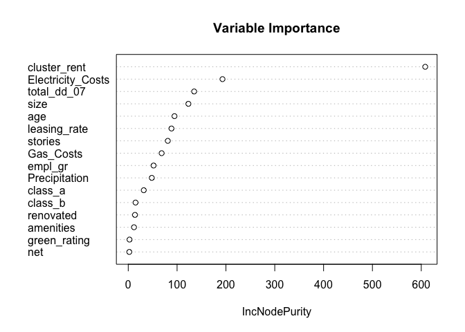

**Assignment 3**

**Problem 1**

**Xiaoyu Liu, Yihao Zhang**

**Overview**

Over the past few years, the general public has paid increasingly close
attention to whether a company is taking the role of contributing to
society, especially from the perspective of the environment. In
commercial real estate, issues of eco-friendliness are intimately tied
up with ordinary decisions about how to allocate capital. Will investing
in an eco-friendly building increase company’s rental income? How to
predict the rental income?

**Data modeling and Analysis**

Before fitting the data with a predictive model, we performed necessary
data cleaning.

-   Removed the variable **LEED** and **Energystar** and use one single
    variable **green\_rating** to represent whether a building is
    econ-friendly or not.
-   Removed the **construction property ID** and the variable
    **cluster** which is not only a building’s identity but can also be
    indentified by regional employment growth rate, annual precipitation
    and cluster rent.
-   Removed Variables **cd.total\_07**, **hd.total\_07** and use
    **total\_dd\_07** to represent both variables.
-   Performed log transformation on all price and unit factors to
    normalize the data (**Rent**, **size**, **Gas\_Costs**,
    **Electricity\_Costs**, **cluster\_rent** and **total\_dd\_07**.

Next, we used LASSO analysis method with 5-fold cross validation to
filter the unnecessary variables and select the significant explanatory
variables since this method penalizes the size of the parameters. To do
so, we find the *l**o**g*(*λ**m**i**n*) value that generated
the lowest **MSE** during the 5-fold cross validation process, including
the consideration of substantial size parameter penalties. Then, we
selected this value of *λ* to build our model. The model is as follow:

$$
log(y)= -0.71802+0.02863log({f\_1})-0.10412log({f\_2})+0.01428log({f\_3})+0.97392log({f\_4})+0.02297x\_1+0.0004x\_2\\\\
-0.00060x\_3-0.00752x\_4+0.08722x\_5+0.02369x\_6+0.01853x\_7-0.02257x\_8+0.01056x\_9
$$

where the variables are defined as follows:

-   *y* is the rent charged to tenants in the building, in dollars per
    square foot per calendar year.
-   *f*1 is the total square footage of available rental
    space in the building.
-   *f*2 is the measure of how much natural gas costs in the
    building’s geographic region.
-   *f*3 is the measure of how much electricity costs in the
    building’s geographic region.
-   *f*4 is the average rent per square-foot per calendar
    year in the building’s local market.
-   *x*1 is the fraction of the building’s available space
    currently under lease.
-   *x*2 is the height of the building in stories.
-   *x*3 is the age of the building in years.
-   *x*4 is whether the building has undergone substantial
    renovations during its lifetime.
-   *x*5 is the indicators for Class A buildings.
-   *x*6 is the indicators for Class B buildings.
-   *x*7 is an indicator for whether the building is either
    LEED- or EnergyStar-certified.
-   *x*8 is an indicator as to whether the rent is quoted on
    a \`\`net contract’’ basis.
-   *x*9 is an indicator of whether at least one of the
    following amenities is available on-site.

Finally, we performed a random forest analysis for variable importance
measurement. This method can help us to verify the variables included in
our predictive model is essential. From our LASSO prediction model, we
generated 13 variables plus one constant.

From the variable importance plot, we can see that among the 8 most
important variables that were defined by random forest analysis, 7 has
been taken account in our predictive model. **total\_dd\_07** has not
been selected for our model is because for each cluster, the value of
**total\_dd\_07** will be the same for all buildings among that cluster,
and cluster can be defined by **cluster\_rent**. **empl\_gr** and
**Precipitation** were selected off from our model due to the same
reason. So, we would like to suggest that our model is making a precise
prediction.

**Conclusion**

Now we will quantify the average change in percentage term of rental
income per square foot associated with green certification, holding
other features of the building constant.

Based on our model, for buildings to be qualified as eco-friendly, the
average rental income per square foot is expected to increase
*e*0.01853 = 1.02. This increase is relatively small, and
from economic perspectives, we would not suggest the company to make
invest in a new eco-friendly building since it will only generate a tiny
amount of increase in rental income.
