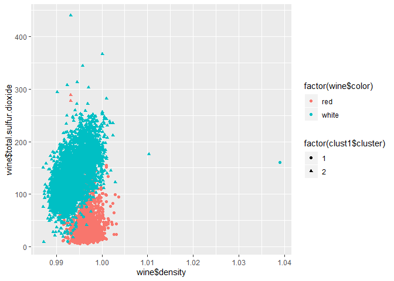
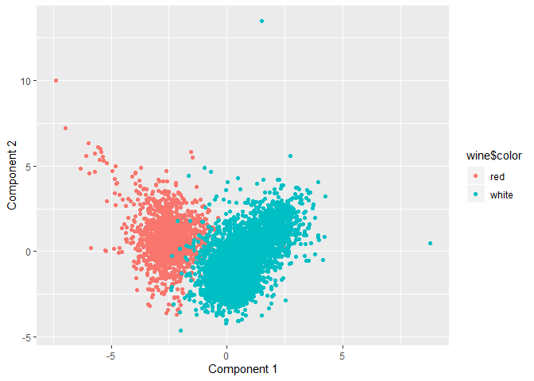
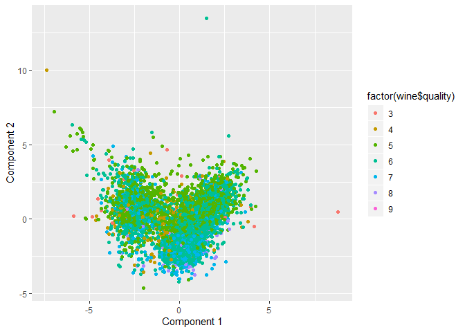

Exercise 3 - Question 3
=======================

### Xiaoyu Liu, Yihao Zhang

The data set that we used for this question contains information on 11
chemical properties of 6500 different bottles of wine. In addition, two
other variables, the color of wine and the quality of wine are also
recorded. What we are gonna do is to apply both PCA and clustering
method to this data set and then compare the results to decide which one
is better for differing the wine color and which one is better for
differing the wine quality.

### 1. Wine color

#### Clustering Model:

For the wine color problem, since we know for sure that there are only
two color kinds in wine so we can just assume K = 2 in this case. Then
we scale and center the data and extract the centers and scales from the
rescaled data. After these steps, we can run k-means with 2 clusters and
25 starts. The correlation between total.sulfur.dioxide and density is
only 0.03239451. Besides, these two characteristics are very typical
presentations for wines. Therefore, we decide to choose these two
variables for the visualization of our clustering models. The qpplot for
our wine color clustering model is below:

In order to check how well it explains, we calculate the accuracy rate.
Using the following confusion matrix, we could get the accuracy rate is
(1575+4830)/6497=98.58%.

<table>
<caption>Table 1: Confusion matrix for clustering model—wine color</caption>
<thead>
<tr class="header">
<th style="text-align: center;">Clusters</th>
<th style="text-align: center;">Red</th>
<th style="text-align: center;">White</th>
</tr>
</thead>
<tbody>
<tr class="odd">
<td style="text-align: center;">1</td>
<td style="text-align: center;">1575</td>
<td style="text-align: center;">68</td>
</tr>
<tr class="even">
<td style="text-align: center;">2</td>
<td style="text-align: center;">24</td>
<td style="text-align: center;">4830</td>
</tr>
</tbody>
</table>

#### PCA Model:

Secondly, we tried the PCA model for differing red wine from white wine.
Using the same scaled and centered data, the qpplot for our wine color
PCA model is below:

Similarly, in order to check how well it explains, we calculate the
accuracy rate. Using the following confusion matrix, we could get the
accuracy rate is (4814+1572)/6497=98.29%.

<table>
<caption>Table 2: Confusion matrix for PCA model—wine color</caption>
<thead>
<tr class="header">
<th style="text-align: center;">Clusters</th>
<th style="text-align: center;">Red</th>
<th style="text-align: center;">White</th>
</tr>
</thead>
<tbody>
<tr class="odd">
<td style="text-align: center;">1</td>
<td style="text-align: center;">1572</td>
<td style="text-align: center;">84</td>
</tr>
<tr class="even">
<td style="text-align: center;">2</td>
<td style="text-align: center;">27</td>
<td style="text-align: center;">4814</td>
</tr>
</tbody>
</table>

As we can see from the accuracy rates, the clustering model is slightly
better for the wine color problem. Let’s try both models for the wine
quality problem in the following.

### 2. Wine quality

#### Clustering Model:

Becasue there are only 3~9 seven different scores of wine quality, we
pick K = 7 for the clusters number. We run a clustering model with seven
clusters and 50 starts.

In order to check how well it explains, we calculate the accuracy rate.
Using the following confusion matrix, we could get the accuracy rate is
(7+63+471+259+190+0+4)/6497=15.36%.

<table>
<caption>Table 3: Confusion matrix for Clustering Model—wine quality</caption>
<thead>
<tr class="header">
<th style="text-align: center;">Clusters</th>
<th style="text-align: center;">3</th>
<th style="text-align: center;">4</th>
<th style="text-align: center;">5</th>
<th style="text-align: center;">6</th>
<th style="text-align: center;">7</th>
<th style="text-align: center;">8</th>
<th style="text-align: center;">9</th>
</tr>
</thead>
<tbody>
<tr class="odd">
<td style="text-align: center;">1</td>
<td style="text-align: center;">7</td>
<td style="text-align: center;">24</td>
<td style="text-align: center;">648</td>
<td style="text-align: center;">640</td>
<td style="text-align: center;">122</td>
<td style="text-align: center;">22</td>
<td style="text-align: center;">0</td>
</tr>
<tr class="even">
<td style="text-align: center;">2</td>
<td style="text-align: center;">5</td>
<td style="text-align: center;">63</td>
<td style="text-align: center;">453</td>
<td style="text-align: center;">545</td>
<td style="text-align: center;">133</td>
<td style="text-align: center;">25</td>
<td style="text-align: center;">1</td>
</tr>
<tr class="odd">
<td style="text-align: center;">3</td>
<td style="text-align: center;">6</td>
<td style="text-align: center;">63</td>
<td style="text-align: center;">471</td>
<td style="text-align: center;">346</td>
<td style="text-align: center;">43</td>
<td style="text-align: center;">2</td>
<td style="text-align: center;">0</td>
</tr>
<tr class="even">
<td style="text-align: center;">4</td>
<td style="text-align: center;">4</td>
<td style="text-align: center;">15</td>
<td style="text-align: center;">193</td>
<td style="text-align: center;">259</td>
<td style="text-align: center;">140</td>
<td style="text-align: center;">14</td>
<td style="text-align: center;">0</td>
</tr>
<tr class="odd">
<td style="text-align: center;">5</td>
<td style="text-align: center;">2</td>
<td style="text-align: center;">26</td>
<td style="text-align: center;">266</td>
<td style="text-align: center;">475</td>
<td style="text-align: center;">190</td>
<td style="text-align: center;">31</td>
<td style="text-align: center;">0</td>
</tr>
<tr class="even">
<td style="text-align: center;">6</td>
<td style="text-align: center;">2</td>
<td style="text-align: center;">2</td>
<td style="text-align: center;">30</td>
<td style="text-align: center;">19</td>
<td style="text-align: center;">2</td>
<td style="text-align: center;">0</td>
<td style="text-align: center;">0</td>
</tr>
<tr class="odd">
<td style="text-align: center;">7</td>
<td style="text-align: center;">4</td>
<td style="text-align: center;">23</td>
<td style="text-align: center;">77</td>
<td style="text-align: center;">552</td>
<td style="text-align: center;">449</td>
<td style="text-align: center;">99</td>
<td style="text-align: center;">4</td>
</tr>
</tbody>
</table>

#### PCA Model:

Later, we tried the PCA model for differing high-quality wine from
low-quality wine. Using the same scaled and centered data, the qpplot
for our wine quality PCA model is below:

Similarly, in order to check how well it explains, we calculate the
accuracy rate. Using the following confusion matrix, we could get the
accuracy rate is (7+2+199+266+476+212+96+0)/6497 = 19.36%.

<table>
<caption>Table 4: Confusion matrix for PCA Model—wine quality</caption>
<thead>
<tr class="header">
<th style="text-align: center;">Clusters</th>
<th style="text-align: center;">3</th>
<th style="text-align: center;">4</th>
<th style="text-align: center;">5</th>
<th style="text-align: center;">6</th>
<th style="text-align: center;">7</th>
<th style="text-align: center;">8</th>
<th style="text-align: center;">9</th>
</tr>
</thead>
<tbody>
<tr class="odd">
<td style="text-align: center;">1</td>
<td style="text-align: center;">7</td>
<td style="text-align: center;">64</td>
<td style="text-align: center;">464</td>
<td style="text-align: center;">347</td>
<td style="text-align: center;">43</td>
<td style="text-align: center;">2</td>
<td style="text-align: center;">0</td>
</tr>
<tr class="even">
<td style="text-align: center;">2</td>
<td style="text-align: center;">1</td>
<td style="text-align: center;">2</td>
<td style="text-align: center;">22</td>
<td style="text-align: center;">9</td>
<td style="text-align: center;">1</td>
<td style="text-align: center;">0</td>
<td style="text-align: center;">0</td>
</tr>
<tr class="odd">
<td style="text-align: center;">3</td>
<td style="text-align: center;">4</td>
<td style="text-align: center;">15</td>
<td style="text-align: center;">199</td>
<td style="text-align: center;">266</td>
<td style="text-align: center;">140</td>
<td style="text-align: center;">14</td>
<td style="text-align: center;">0</td>
</tr>
<tr class="even">
<td style="text-align: center;">4</td>
<td style="text-align: center;">5</td>
<td style="text-align: center;">60</td>
<td style="text-align: center;">442</td>
<td style="text-align: center;">476</td>
<td style="text-align: center;">110</td>
<td style="text-align: center;">26</td>
<td style="text-align: center;">1</td>
</tr>
<tr class="odd">
<td style="text-align: center;">5</td>
<td style="text-align: center;">4</td>
<td style="text-align: center;">26</td>
<td style="text-align: center;">244</td>
<td style="text-align: center;">487</td>
<td style="text-align: center;">212</td>
<td style="text-align: center;">35</td>
<td style="text-align: center;">0</td>
</tr>
<tr class="even">
<td style="text-align: center;">6</td>
<td style="text-align: center;">2</td>
<td style="text-align: center;">21</td>
<td style="text-align: center;">102</td>
<td style="text-align: center;">609</td>
<td style="text-align: center;">447</td>
<td style="text-align: center;">96</td>
<td style="text-align: center;">4</td>
</tr>
<tr class="odd">
<td style="text-align: center;">7</td>
<td style="text-align: center;">7</td>
<td style="text-align: center;">28</td>
<td style="text-align: center;">665</td>
<td style="text-align: center;">642</td>
<td style="text-align: center;">126</td>
<td style="text-align: center;">20</td>
<td style="text-align: center;">0</td>
</tr>
</tbody>
</table>

In conclusion, the clustering model is more accurate for the wine color
problem while the PCA model will be better for the wine quality problem.
Because clustering assumes that each data point is a member of only one
cluster and clusters are mutually exclusive, every bottle of wine has
its certain color so clustering will be an appropriate model for this
problem. Moreover, the wine quality problem is more complicated and can
be affected by many different factors. PCA assumes that each data point
is like a combination of multiple basic “ingredients”. PCA is useful for
compression, denoising, plotting, and making sense of data sets that
initially seem too complicated to understand. So PCA is better for the
wine quality problem.
