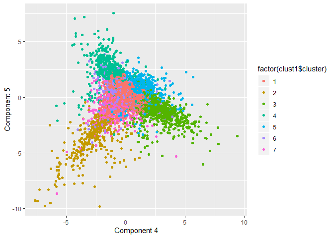
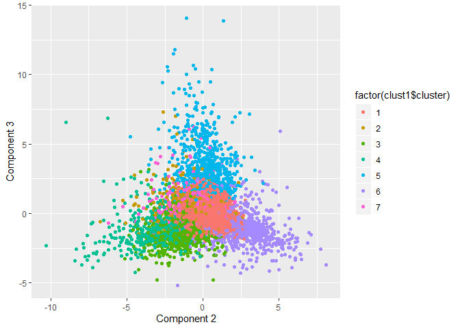
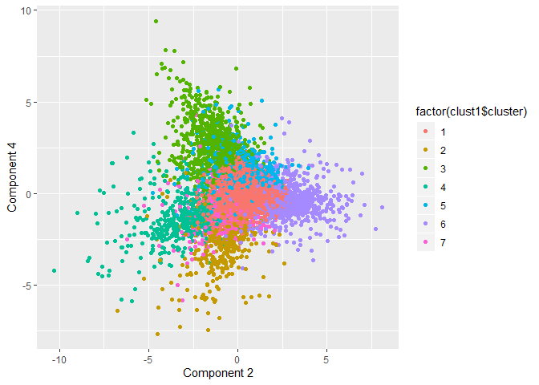
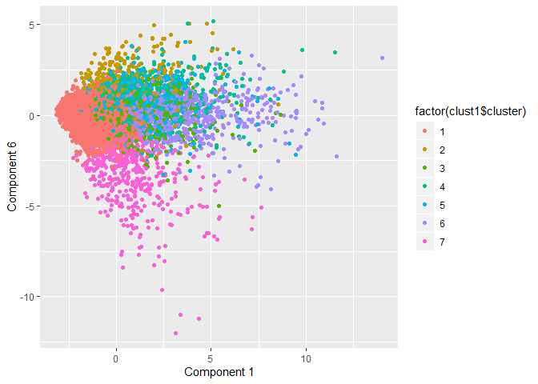

Exercise 3 - Question 4
=======================

### Xiaoyu Liu, Yihao Zhang

The data set we used for this part is a Twitter post collection of a
group of followers over seven days in June 2014. Each tweet was
categorized based on its content using a pre-specified scheme of 36
different categories, each representing a broad area of interest. What
we need to do is to identify some interesting market segments that
appear to stand out in the social-media audience.

First of all, we believe that the variables like “chatter”,
“uncategorized”, and “spam” may be useless and harmful to our results so
we just delete them from our data set. If people send too many tweets or
the user is actually a robot, such facts will influence our model
accuracy. After that, we scaled and centered our data to be prepared for
modeling.

In order to choose the best K value for clustering, we try many
clustering with different k values ranging from 2 to 20. Our elbow plot
are presented below, the optimal K seems to be 7 by the method.

Then we model with 7 clusters and 50 starts. Here we divide these 7882
users into seven clusters. However, if we want to identify these seven
market segments, we need more characteristics of these seven clusters.
Since we have 33 explaining variables in the data set, it will be too
complicated if we try to pair different two variables and find the
significant characteristic of these groups. We believe that if we use
PCA’s components to explain, it will be easy to understand.

Hence, we applied the PCA method to our revised data. In the summary of
PCA, we can see that the first 7 components are able to explain 52.52%
of the 33 variables. Later, we want to figure out what are these seven
components. So we find the five highest proportion of variables that are
in each component. Details are listed below:

**Component 1: “religion”, “food”, “parenting”, “sports\_fandom”,
“school”, “family”**

**Component 2: “sports\_fandom”, “religion”, “parenting”, “food”,
“school”, “family”**

**Component 3: “politics”, “travel”, “computers”, “news”, “automotive”**

**Component 4: “health\_nutrition”, “personal\_fitness”, “outdoors”,
“politics”, “news”**

**Component 5: “beauty”, “fashion”, “cooking”, “photo\_sharing”,
“shopping”, “computers”**

**Component 6: “online\_gaming”, “sports\_playing”, “college\_uni”,
“cooking”, “automotive”**

**Component 7: “automotive”, “shopping”, “photo\_sharing”, “news”,
“current\_events”**

Then we draw some plots to see how these components are related to our
seven clusters.

**Cluster 1: ** We can see from the plot below that our first cluster
(red points) consists of more component 5 and less component 4. This
cluster can be some young fashion ladies that don’t exercise a lot and
ignore health nutrition in daily lives.

**Cluster 2: ** We can see from the plot below that our second cluster
(brown points) consists of more component 6 and less component 4. This
cluster can be some young lazy teenage boys that enjoy games and sports.

**Cluster 3 & Cluster 6: ** We can see from the plot below that our
third cluster (green points) consists of more component 3 and less
component 2. Cluster 3 can be some computer engineers that love
travelling and care about politics. Our sixth cluster(purple points)
consists of more component 2 and less component 3. Cluster 6 can be some
middle-aged parents that are fond of food and sports.

**Cluster 4: ** We can see from the plot below that our fourth cluster
(light green points) consists of more component 4 and less component 2.
This cluster can be a group of people who enjoy exercise and have a
focus on nutrition.

**Cluster 5: ** We can see from the plot below that our fifth cluster
(blue points) consists of many component 1 and negative component 6.
This cluster can be some religious parents.

**Cluster 7: ** We can see from the plot below that our seventh cluster
(brown points) consists of more component 7 and less component 1. This
cluster can be some young males that are car enthusiast.

